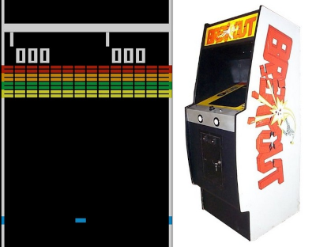
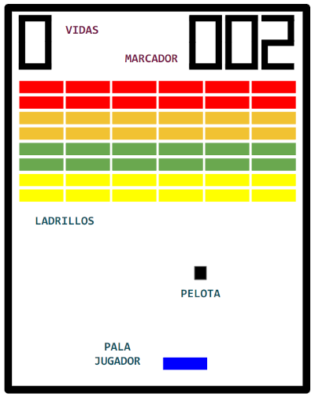

#### C.E. DVRV

### Programación y Motores de Videojuegos

#### Project: Breakout

`[Unity ver.: 6.2.6f2]`

## Diseño

### Concepto

- **Título:** Breakout

- **Plataforma:** PC

- **Género:** Arcade, Casual

- **Cámara:** Juego 2D con vista cenital

- **Descripción:**

  - Port para PC del juego Breakout, Atari (1976).

  - Juego para un jugador en el que el objetivo es romper los ladrillos de la parte superior de la pantalla golpeándolos con una pelota. Para ello, el jugador dispone de una raqueta que mueve horizontalmente.

  - Si la pelota sale por la parte inferior, el jugador pierde una vida. Si pierde tres vidas, la partida finaliza.

### Elementos de diseño

### Mecánicas

- El jugador maneja su pala horizontalmente.

- La pelota está en continuo movimiento, rebotando sobre la palas y sobre los laterales que delimitan la zona de juego.

- Si la pelota toca la pared inferior del campo, el jugador pierde una vida.

- Si el jugador pierde todas sus vidas, el juego finaliza.

- Si la pelota toca un ladrillo, éste se destruye.

- La fase finaliza cuando el jugador destruye todos los ladrillos.

- Existirán múltiples fases, con configuraciones de ladrillos y dificultades diferentes.

- Si se superan todas las fases, el juego termina.

- Cuando se pierde una vida, nos mantendremos en la fase actual y la pelota se relanzará desde el centro del campo con un ángulo aleatorio.

- El juego mostrará la puntuación actual del jugador.

- Se reproducirán sonidos en los rebotes y al conseguir puntos.

### Mecánicas adicionales (práctica)

- Aumentar la velocidad de la pelota a media que rebota. Por ejemplo, el juego original, la velocidad se incrementa cuando la pala golpea la pelota un múltiplo de 4 (4, 9, 12, 16,...).

- Variar el tamaño de la pala. En el juego original, la pala se hace más pequeña la primera vez que la pelota toca la pared superior.

- Incrementar el número de vidas al alcanzar cierta cantidad de puntos.

- Convertir el juego en un juego para dos jugadores añadiendo una segunda pala.

- Convertir el juego en un juego para dos jugadores alternativos, cada uno con su marcador y número de vidas.
